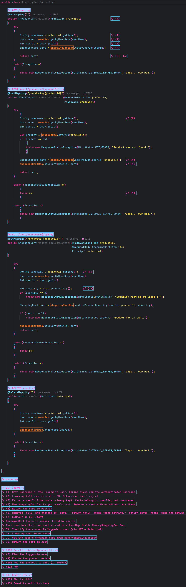
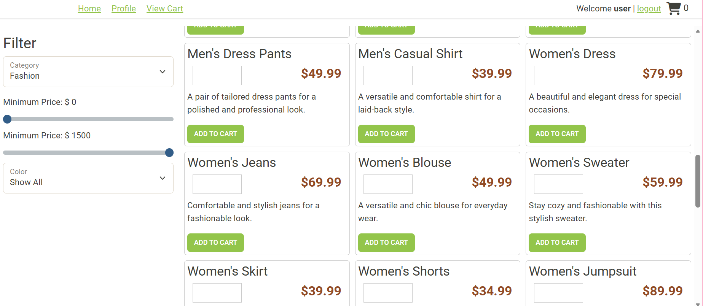
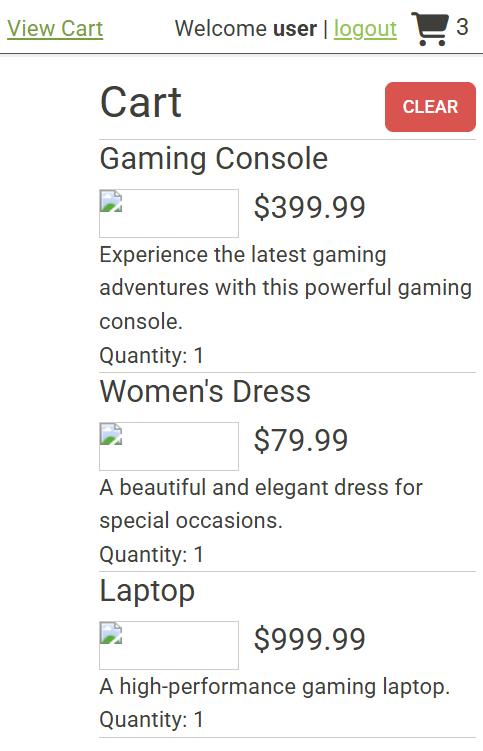
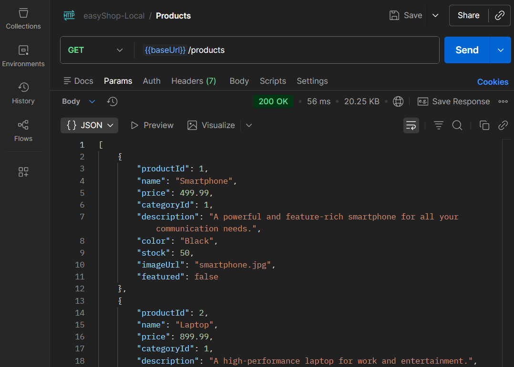
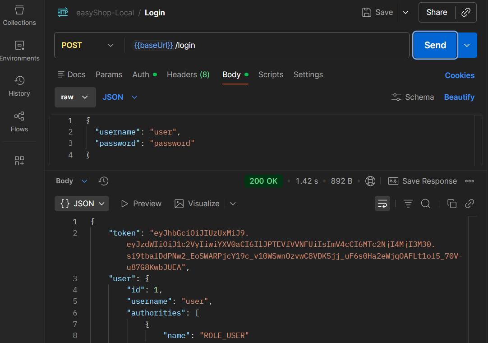
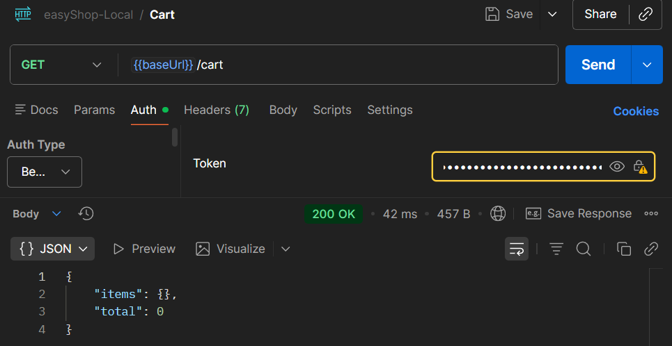
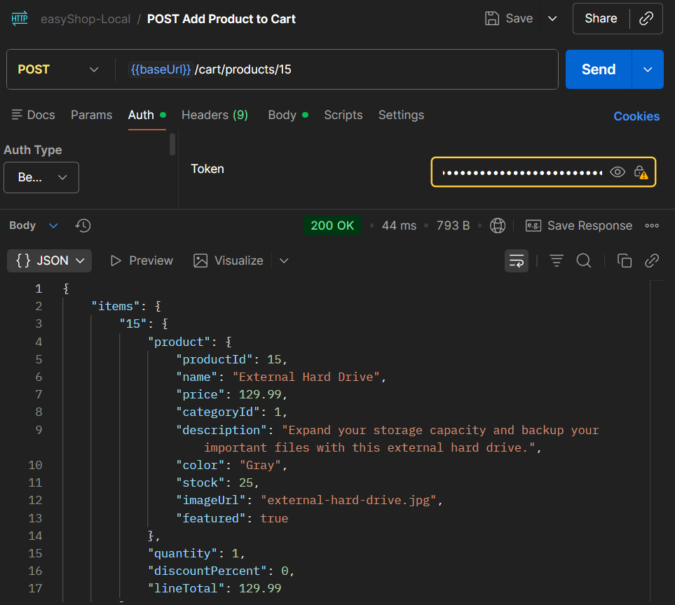

# EasyShop E-Commerce API

This project is a Spring Boot backend API for an e-commerce application called **EasyShop**.  
It supports categories, products, authentication, and a shopping cart.

## Features
- View all categories and products
- Filter products by category, price, and color
- User authentication with JWT
- Add, update, and remove items from a shopping cart
- Admin-only product and category management
- API tested using Postman

## Tech Stack
- Java
- Spring Boot
- MySQL
- JWT Authentication
- Postman

## How to Run
1. Start MySQL and ensure the `easyshop` database exists
2. Run the Spring Boot application from IntelliJ
3. Access the API at: http://localhost:8080

## API Testing
All API endpoints were tested using Postman, including:
- Authentication (`/login`)
- Categories (`/categories`)
- Products (`/products`)
- Shopping Cart (`/cart`)

## Interesting Code
Check out my notes on the ShoppingCartController! Authenticated users can safely manage cart items using JWT and role-based access control.

## Screenshots

— FRONTEND

Products

Cart with Items Added

— POSTMAN

GET /products

POST /login token

GET /cart

POST /cart/products/{id}
